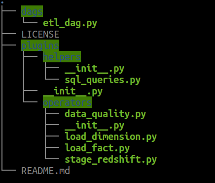
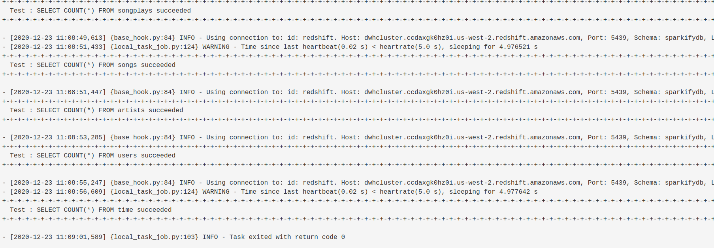

# Sparkify : Your Provider for The World Best Music Library

This repository contains scripts for **E**xtracting music data from AWS S3 bucket and loading them into AWS Redshift staging tables, **T**ransform these data to match the **sparkifydb** database schema, and **L**oad the transformed data into the database final fact and dimension tables, all this automated using **Apache Airflow**.

The two staging tables schemas are represented below :

| staging_events | staging_songs |
|----------------|---------------|
|||

Following is a diagram representing the database schema, with 1 fact table `songplays` and 4 dimension tables `users`, `time`, `songs` and `artists` :


The database design follows a `star schema` to help our analyst team, **The Sparkalysts**, in their mission to answering the questions running through the head of our CEO **The Big Spark** such as :

1. List of songs listened by user `Lily` `Koch` ?
2. In which year did our users listened the most to music ?
3. ...

## Project dataset

We have two datasets stored on S3 buckets :
* song data : json files representing a subset of the **Million Song Dataset**; sample of song file below :
	```json
	{
		"song_id": "SOUYDPQ12A6D4F88E6",
		"num_songs": 1,
		"title": "Tears Of Joy",
		"artist_name": "Wendy & Lisa",
		"artist_latitude": null,
		"year": 1989,
		"duration": 278.46485,
		"artist_id": "ARN4X0U1187B9AFF37",
		"artist_longitude": null,
		"artist_location": ""
	}
	```
* log data : json files representing our users' activities regarding the songs; sample log record :
	```json
		{
			"artist": null,
			"auth": "Logged In",
			"firstName": "Walter",
			"gender": "M",
			"itemInSession": 0,
			"lastName": "Frye",
			"length": null,
			"level": "free",
			"location": "San Francisco-Oakland-Hayward, CA",
			"method": "GET",
			"page": "Home",
			"registration": 1540919166796.0,
			"sessionId": 38,
			"song": null,
			"status": 200,
			"ts": 1541105830796,
			"userAgent": "\"Mozilla/5.0 (Macintosh; Intel Mac OS X 10_9_4) AppleWebKit/537.36 (KHTML, like Gecko) Chrome/36.0.1985.143 Safari/537.36\"",
			"userId": "39"
		}
	```

## Project Structure

The project is structured as follow:



* `dags` folder contains two dag files:
  * `dag_songs.py` : defines a DAG that creates all the tables, copies song data into staging table, and load songs and artists data into `songs`and `artists` tables resp.
    	 
  * `dag_events.py` : defines a DAG that copies events data into staging table, and load songplays, time and users data into `songplays`, `time` and `users` tables resp.
 
* `plugins/helpers` folder contains a `sql_queries.py` that defines the sql queries using in the ETL process
* `plugins/operators` folder contains custom operators definitions:
  * `stage_redshift.py` defines operator for copying data from s3 json files to staging table in Redshift
  * `load_dimension.py` defines operator for loading data to dimension tables
  * `load_fact.py` defines operator for loading data to fact table
  * `data_quality.py` defines operator for assessing the quality of the data at the end of ETL process

## Project Setup

The first requirement is to have a running airflow platform.
The second requirement is to create a redshift cluster and configure the connections to AWS and Redshift in the airflow interface:

* the aws connection should be named `aws_credentials`
* the redshift connection should be named `redshift`

To run the project, first enable the `songs_data_dag` DAG (first diagram above) and trigger the run. This should normally be run once. It'll create all the tables, load songs staging data, and load data into `songs` and `artists` tables. 

Next disable the `songs_data_dag` DAG and enable the `events_data_dag` DAG. This DAG is scheduled to run daily ETL tasks from `2018-11-01` to `2018-11-30`. The tasks include loading the daily events from s3 to staging table, loading data into `songplays`, `users` and `time` tables, and applying data quality checks to detect empty tables.

If everything went well at the end of the data quality checks uo should have something like this in the end of the log view saying that the Data quality check succeeded  for each table:
	

## Design choice

For all dimension tables, primary key is used as sort keys as they will be used all the time for joining with fact table.

For the fact table, the `start_time` column is used as distribution key and sort key, as a very frequent query would be to get activities for a given range date, given months, days, ... Also distributing according to this column may give more even balanced distribution across nodes. Other candidate columns for distribution key are `song_id` and `artist_id`, as there might also be frequent to join with song and artist tables respectively

## TO-DO List

* [ ] Add Analytic Dashboard for easier interaction with the database
* [ ] Add more sophisticated quality checks based on business logic
* [ ] Refactor the operators to make them even more modular
* [ ] Run performance benchmark to compare different distribution strategies adn distribution keys choices
